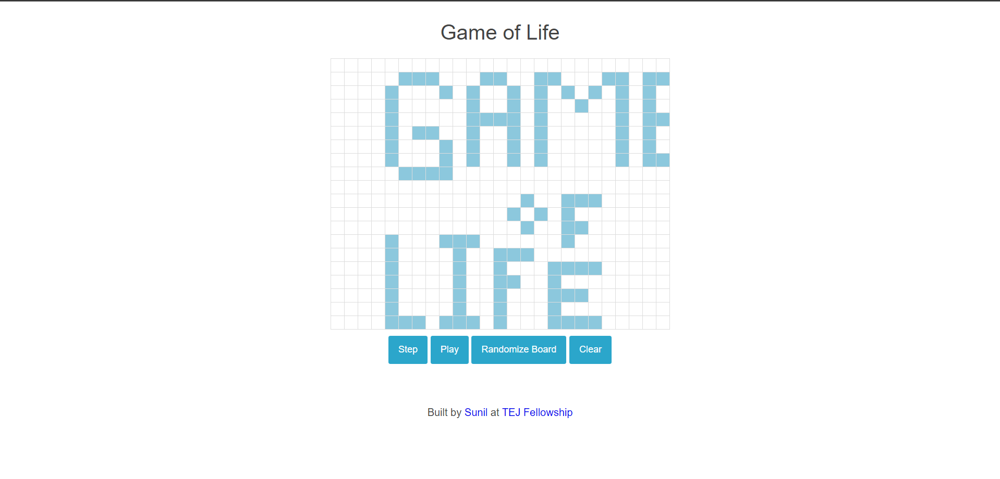

# Game of Life in JS

[Conway's Game of Life](https://en.wikipedia.org/wiki/Conway's_Game_of_Life) is a set of rules governing the destruction, persistence, or propagation of neighboring cells in a grid — a pseudo-simulation of life. It was created by John Horton Conway in 1970, in an effort to simplify a concept by the mathematician John von Neumann in the 1940s. The intent and power of the game is not in realistically simulating life, but rather in serving as a simple system that produces complex behavior. In fact, the Game of Life is a [universal Turing machine](http://en.wikipedia.org/wiki/Turing_machine), capable of modeling any algorithmic calculation.

## Table of Content

- [Installation and Usage](#installation-and-usage)
- [How To Play?](#how-to-play-the-game)
- [ScreenShots](#screenshots)
- [Future Expansion](#further-expansion)

## Installation and Usage

Simply visit [GitHub hosted page](https://tajpuriya27.github.io/game-of-life/) to play the game online.

**To use it locally**

1. Clone the repository.
2. Open the `index.html` file in any browser. OR, use the `VS-code` IDE and use `live-server` extension to host the code locally.

## How to play the game?

The game of life is played on a 2D board (easily modeled as a 2D array), where each cell has two possible states: _living_ or _dead_. For each iteration of the board state, the destiny of each cell is determined by these four rules:

1. Any live cell with two or three live neighbors lives on to the next generation.
2. Any live cell with fewer than two live neighbors dies, as if caused by under-population.
3. Any live cell with more than three live neighbors dies, as if by overcrowding.
4. Any dead cell with exactly three live neighbors becomes a live cell, as if by reproduction.

The initial pattern constitutes the seed of the system. The first generation is created by applying the above rules simultaneously to every cell in the seed — in other words, each generation is a pure function of the preceding one. The discrete moment at which all the births and deaths actually occur is often called a step. The rules are applied repeatedly to create further generations (one new generation per step).

## Screenshots:

## Further Expansion:

- Click on any td element of table and drag to paint the boxes.
